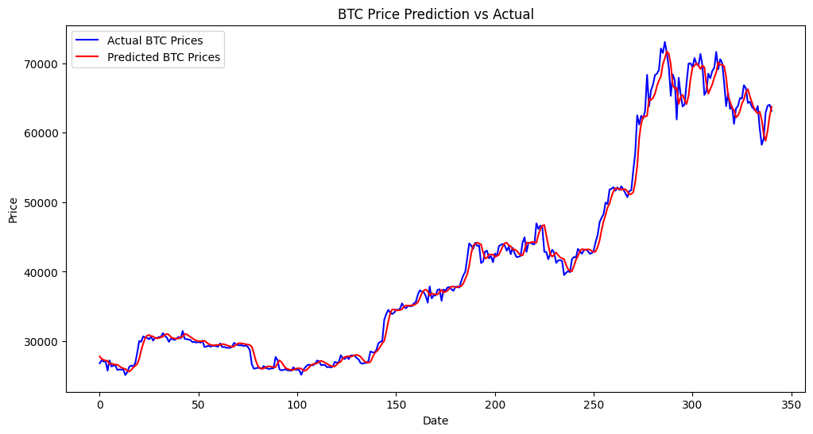

# Title: Forecasting Bitcoin Prices with Time Series Analysis

Time series forecasting has become crucial in financial markets, especially in predicting volatile assets like Bitcoin. With the explosive rise and fluctuations in BTC prices, accurate predictions can lead to significant financial advantages. In this project, we'll use historical BTC data and deep learning models to forecast future prices. 

## Dataset

The data set used in this project is called [BTC-USD](https://www.kaggle.com/datasets/saswattulo/bitcoin-price-history-btc-usd?resource=download), from kaggle.

Within this dataset, there is over 3,650 rows meticulously recording Bitcoin's opening, closing, high, and low prices denominated in USD for each day spanning 10 years. It encapsulates the entire trajectory - from Bitcoin's humble beginnings trading for just a few hundred dollars, through its multiple boom and bust cycles hitting record highs above $60,000, to its performance amid the turbulence of recent years.

- the closing prices from the "Close" column were used to train the model.
- No missing values were detected.
## Data Preprocessing

The data within the dataset was pretty straight forward and simple to prepare before processing. since they were no missing values below where the techniques used.

- Irrelevant columns where dropped leaving only the "Close" column. 
- The values were Normalized

```
df["Close"] = df.rename(column={"Close":"closing_price"}) # renamed for simplicity. 
print(df.isnull().sum()) # output was 0

scaler = MinMaxScaler()
df['closing_price'] = scaler.fit_transform(df[['closing_price']])

```

### Data structure 
The dataset wasstructured in such a way that the model can learn from sequential patterns from the data. some common approaches would be batching and windowing.


### More on structuring and optimizing inputs for better outcomes

- Batching: I used a batch size of 32. this means that instead of loading the whole dataset in memory, only batches of 32 samples would be loaded. this was both more efficient for the memory usage and the took advantage of the GPU's parallelism feature(where several Batches could be processed in parallel).
- Windowing During training smaller segments called "windows," where each window represents a set of consecutive time steps were created. The window size i chose was 50 since my training data had over 1500 entries and I wanted to focus on the smallest changes. I wanted the model to look at the past 100 time steps to predict the next value.

```
# Time series window 
def create_dataset(data, window_size, shuffle=False):
    x, y = [], []
    
    for i in range(window_size, len(data)):
        x.append(data.iloc[i - window_size:i].values)
        y.append(data.iloc[i].values)
    
    x, y = np.array(x), np.array(y)
    
    if shuffle:
        indices = np.arange(x.shape[0])
        np.random.shuffle(indices)
        x, y = x[indices], y[indices]

    return x, y

# Usage
window_size = 50
x_train, y_train = create_dataset(train_data, window_size, shuffle=True)
x_test, y_test = create_dataset(test_data, window_size, shuffle=False)
```

### Note:
the test data was not shuffled, this would help in accurately evaluating the model.

## Model Architecture
For this Bitcoin price forecasting task, I used a Long Short-Term Memory (LSTM) network, which is a type of Recurrent Neural Network (RNN). LSTMs are particularly well-suited for time series forecasting tasks due to their ability to capture long-term dependencies in sequential data.

### Why I Chose LSTM:
- Handling Long-Term Dependencies: Time series data often contains trends and patterns spread over long periods. LSTM can retain important information for a longer sequence, making it ideal for forecasting tasks like BTC price prediction.
- Prevention of Vanishing Gradient Problem: Traditional RNNs suffer from the vanishing gradient problem, especially when dealing with long sequences. LSTMs use a gating mechanism to maintain a more stable learning process over time, which helps in improving performance on time series data.
- Success in Financial Data: LSTM models have been widely used in financial forecasting tasks due to their ability to handle sequential and noisy data.

```
# setup early stopping
early_stopping = EarlyStopping(monitor='val_loss', patience=10, restore_best_weights=True)

# model checkpoint
model_checkpoint = ModelCheckpoint('best_model.keras', save_best_only=True)

# Build the LSTM model
model = Sequential([
    LSTM(100, return_sequences=True, input_shape=(window_size, 1)),
    Dropout(0.2),
    LSTM(100),
    Dropout(0.2),
    Dense(1)
])
# Compile the model
model.compile(optimizer='adam', loss='mean_squared_error')


model.fit(x_train, y_train, epochs=50, batch_size=32, validation_data=(x_val, y_val), callbacks=[early_stopping, model_checkpoint])
predictions = model.predict(x_test)
mse = mean_squared_error(y_test, predictions)
mae = mean_absolute_error(y_test, predictions)
rmse = np.sqrt(mse)
r2 = r2_score(real_prices, predicted_prices) 

# Print metrics
print(f'MAE: {mae}, RMSE: {rmse}, R-squared: {r2}') # output: MAE: 0.012654138863596835, RMSE: 0.019563717516366968, R-squared: 0.9878722262871336
```
Model: "sequential_8"

----------------------------------------------------------------------------
| Layer (type)                       | Output Shape            | Param #   |
|------------------------------------|-------------------------|-----------|
| lstm_16 (LSTM)                     | (None, 50, 100)         | 40,800    |
| dropout_14 (Dropout)               | (None, 50, 100)         | 0         |
| lstm_17 (LSTM)                     | (None, 100)             | 80,400    |
| dropout_15 (Dropout)               | (None, 100)             | 0         |
| dense_8 (Dense)                    | (None, 1)               | 101       |


 Total params: 363,905 (1.39 MB)

 Trainable params: 121,301 (473.83 KB)

 Non-trainable params: 0 (0.00 B)



- In most cases, the model output appeared smoother than the actual BTC prices. After my Research about this issue, I learnt that This is a result of the LSTM learning a general pattern in the data rather than predicting individual day-to-day fluctuations. It’s often referred to as the "smoothing effect," where models tend to output more stable predictions.

- Occasionally, there was a slight lag in the predictions. I was told reducing the window size may be helpful in regards to this.